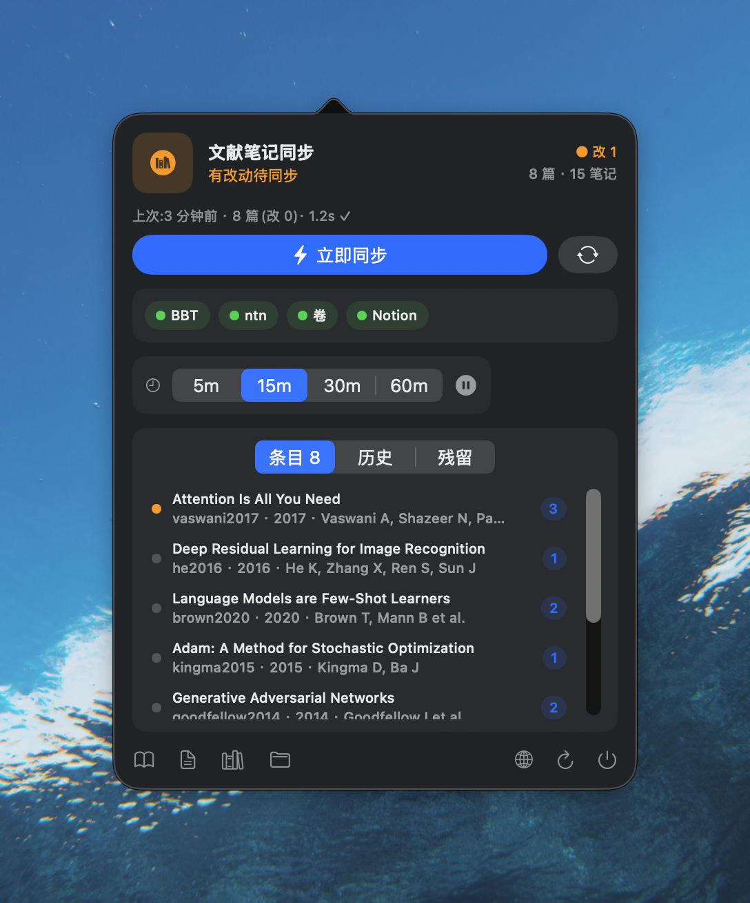
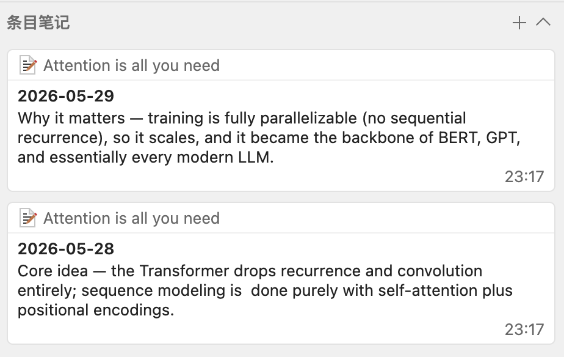
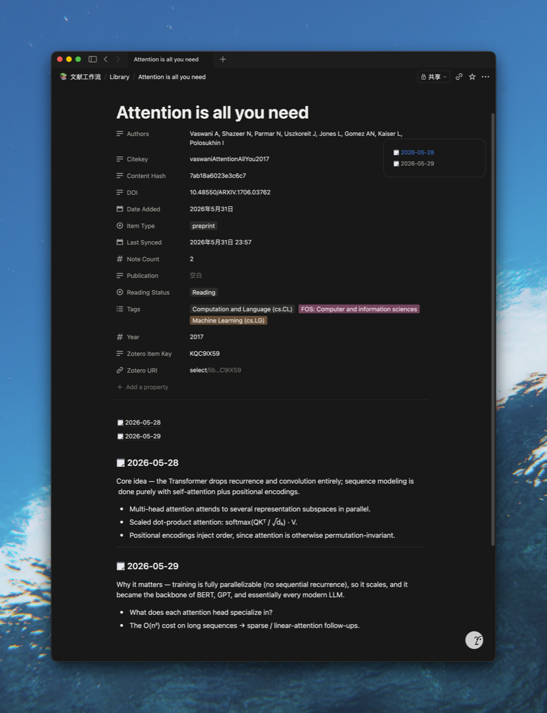

# ntncite


[](https://brooksc02.github.io/ntncite/)

[English](README.md) · **中文** · [项目主页](https://brooksc02.github.io/ntncite/)

**把你的 Zotero 文献库干净地镜像进 Notion。** 一个自托管、无插件的同步工具,基于 Notion 官方的
**`ntn`** CLI —— 灵感来自 [Notero](https://github.com/dvanoni/notero)。

**一篇论文一行**:题录元数据放属性,你写的读书笔记作为干净的 Notion block 进页面正文 —— 没有
`Zotero Notes` 外壳、没有重复日期,正文最前面还带一个目录。同步的是你**正在读**的论文(标过笔记的那些),
最近更新的排在最前。还附带一个 **macOS 菜单栏 App**,一眼看同步状态、手动触发、查历史。

> 为 macOS · Zotero + Better BibTeX 而做。这是我个人的工作流,分享出来万一对你有用。

## 截图

<p align="center">
  
</p>

> 截图用的是 **demo 数据**(著名公开论文)。零配置预览界面:
> `cd menubar && swift build && NTNCITE_DEMO=1 .build/debug/Ntncite`,然后点菜单栏的 📚 打开。
> 右下角 🌐 切换 English / 中文。

## 在 Notion 里长什么样

每篇论文 = Notion「Library」库里的**一行**。点开一行:

- **属性** —— 标题、作者、年份、DOI、期刊、citekey、条目类型、标签、Zotero URI、阅读状态、笔记数、加入日期。
- **一个目录**,然后是**你的笔记各自成块** —— 每条笔记单独成段,按你写的顺序排。没有外壳、没有重复日期、没有插件垃圾。

行按**最近更新优先**排序,正在读的自然浮到最上面。手改**阅读状态**是安全的 —— 同步不会覆盖它(其余字段以 Zotero 为准)。

<p align="center">
  <br>
  <sub><i>你在 Zotero 里的笔记 …</i></sub>
</p>
<p align="center">
  <br>
  <sub><i>… 变成一页干净的 Notion:属性 + 目录 + 笔记成块</i></sub>
</p>

## 缘起

`ntncite` 来自两件事:[Notero](https://github.com/dvanoni/notero) 的启发(把 Zotero 阅读
镜像进 Notion 这个点子),以及 Notion 官方 **`ntn`** CLI 的发布 —— 后者让"**以你本人身份、无需
integration token** 写 Notion"成为可能。这个组合让我能做出想要的版本:

- **干净** —— 一篇论文一行;每条笔记各自成块;元数据进真实属性(无注入外壳)。
- **免 token** —— 经 `ntn` 写入,以你本人身份认证;不用粘贴/轮换任何密钥。
- **自持** —— 纯 TypeScript;schema 和管道都归你。
- **完整** —— 题录 + 笔记一起同步。
- **幂等 + 自动** —— 按 Zotero item key 去重;经 launchd 后台运行。

## 工作原理

```
Zotero (zotero.sqlite, 只读)            Better BibTeX JSON-RPC (:23119)
   笔记 + 题录元数据          ───────►   citekey
            │
            ▼
   按论文分组 · HTML → Markdown → Notion blocks(嵌套 ≤ 2 层)
            │
            ▼
   upsert 到 Notion「Library」库   (经 ntn · 按 Zotero Item Key 去重 · 幂等)
```

两部分:

| | 是什么 | 技术栈 |
|---|---|---|
| **`cli/`** | 同步引擎 —— 手动或后台(launchd) | TypeScript / Node |
| **`menubar/`** | 菜单栏 App:状态 · 一键同步 · 健康灯 · 历史 | SwiftUI |

## 前置条件

- **macOS**(Apple Silicon 或 Intel;用 launchd,菜单栏 App 是 SwiftUI / `MenuBarExtra`)。
- **Zotero** 开着(在 9.x 上测过)+ **Better BibTeX** 插件(同步靠 BBT 的 JSON-RPC :23119 解析
  citekey,所以 Zotero 必须开着)。
- **Node 22+** 和 **pnpm**。
- **`ntn`**(Notion 官方 CLI)已安装并登录。用 `curl -fsSL https://ntn.dev | bash`(或 `npm install --global ntn`)
  装,再 `ntn login`;`ntn api v1/users/me` 能返回你的账号即可。写 Notion 靠它,不需要 integration token。

## 安装

```bash
git clone https://github.com/BrooksC02/ntncite && cd ntncite/cli
pnpm install
cp config.example.json config.json          # 填 zoteroDataDir(默认 ~/Zotero)
pnpm setup-db <notion-父页面-id>             # 自动建「Library」库 + 回填 config
pnpm sync --dry-run                          # 预览将同步什么
pnpm sync                                    # 真同步
```

`pnpm setup-db` 会在你拥有的某个页面下(传它的 ID)创建一个符合下面 schema 的 Notion 数据库,
并把它的 data source id 写进 `config.json`。想手动建库?创建一个含下列属性的数据库(名字必须完全一致):

| 属性 | 类型 | | 属性 | 类型 |
|---|---|---|---|---|
| Name | Title | | Tags | Multi-select |
| Authors | Text | | Zotero URI | URL |
| Year | Number | | Reading Status | Select |
| DOI | Text | | Note Count | Number |
| Publication | Text | | Date Added | Date |
| Citekey | Text | | Content Hash | Text |
| Item Type | Select | | **Zotero Item Key** | Text *(去重主键)* |
| | | | Last Synced | Date |

这些字段里只有 **Reading Status** 归你改 —— 同步永不覆盖它。其余每次同步都按 Zotero 重写;`Content Hash` / `Zotero Item Key` / `Last Synced` 是同步自己的记账字段(别手改)。

### 后台自动同步(可选)

```bash
cd cli && sh launchd/install.sh        # 每 15 分钟 + Zotero 写库时触发 + 登录自启
sh launchd/uninstall.sh                # 卸载这个 agent
```

### 菜单栏 App(可选)

```bash
cd menubar && sh launchd/install.sh    # 编译、安装、自启;菜单栏出现 📚
# 或用 Xcode 打开 menubar/Package.swift 然后 Run
```

App 显示:

- **状态 + 待同步明细** —— 上次同步摘要 + `新 N · 改 M` 计数。
- **在读列表** —— 每篇带状态点(🔵新 / 🟠改 / 灰已同步)+ 未同步内嵌图标 🖼;点击 → 在 Notion 打开。
- **历史** —— 每次的增 / 改 / 跳过 + 耗时,以及**哪几篇失败、为什么**。
- **残留 tab** —— 按需查 Notion 里已无 Zotero 对应的页(点开 → 手动删)。
- **健康灯** —— BBT · ntn · 卷 · Notion。

它只驱动 CLI —— 同步逻辑不在 App 里。

## 用 AI agent 部署

打算用 AI agent(Claude Code / Cursor / Codex 等)来装?把它指向这个仓库,让它**先读 [`AGENTS.md`](AGENTS.md)** —— 一份专门写给 agent 的分步部署手册。

有两件事 agent 得靠*你*:`ntn login` 是交互式的(它替你做不了),以及它会问你「Library」库要建在哪个 Notion 页面下。首次真同步前它还会先给你看一份 `--dry-run` 计划 —— 那次会写进你的 Notion,过目一下。

## 命令

详见 [`cli/README.md`](cli/README.md)。速查:

```bash
pnpm sync --dry-run | --force | --citekey <ck> | --auto
pnpm sync --status | --doctor | --list | --orphans   # JSON,菜单栏 App 用
```

## 同步语义

严格单向:**Zotero 是唯一真理源,Notion 是镜像。** 脚本只读 Zotero、从不回写。每篇论文按 Zotero
item key 匹配,用 content hash 判断该页要 create / skip(无变化)/ update;`update` 会按笔记
**当前**的 Zotero 内容**整页重渲染正文**。

实际含义:

- **在 Notion 页正文里改东西不持久。** 这篇下次 `update` 时正文会按 Zotero 整体重渲染、覆盖你的
  改动;元数据属性(Authors、Tags…)同理。**唯一例外是 `Reading Status`** —— 同步永不覆盖它,
  这个字段归你在 Notion 管。
- **改 / 删 Zotero 笔记会传导过来。** 改笔记 → 下次同步更新该页;删掉多笔记论文里的一条 → 下次
  同步那一段从 Notion 消失。
- **删光一篇的最后一条笔记(或删整个 item)不会删 Notion 页。** 它只是不再被同步,页面变成停在
  旧内容的残留页 —— 想去掉请在 Notion 手动删。
- **冲突一律以 Zotero 为准,不做合并。** 只要这篇的 Zotero 笔记动过,`update` 就用 Zotero 覆盖
  Notion 正文(你在那儿的改动丢失);若只动了 Notion、Zotero 没动则 skip、改动暂时保住 —— 但只到
  你下次碰那条 Zotero 笔记为止。

经验法则:把页面**正文**当只读。自己的笔记记在 Zotero,想在 Notion 自留的东西放 `Reading Status`
(或另起一个不被同步的页面)。

## 限制

- 仅 macOS;仅个人库(`libraryId` 1);同步时 Zotero + BBT 必须开着。
- 只同步**有笔记的论文**(= 在读)。笔记里的内嵌图片不同步(占位文本)。深层嵌套列表会被压到
  Notion 单请求的 2 层上限。
- 插件生成的伪笔记会被跳过(Chartero 阅读历史 / addon 存储 / "Do not modify" 占位)—— 只同步你手写的真实笔记。

## 排错

- **`ntn: command not found` / 没登录** —— 装上 Notion 的 `ntn` CLI(`curl -fsSL https://ntn.dev | bash`)并 `ntn login`;`ntn api v1/users/me` 能返回你的账号即可。
- **什么都没同步** —— 只同步**有笔记**的论文(即「在读」)。先在 Zotero 里给它写条笔记。
- **同步中止 / 连不上 `BBT JSON-RPC`** —— Zotero 必须**开着**且装了 Better BibTeX(它在 `:23119` 提供 citekey)。开 Zotero 再试。
- **`schema validation failed: missing field …`** —— Notion 库缺了某个属性。重跑 `pnpm setup-db`,或手动补上(名字要跟上面 schema 表**完全一致**)。
- **Zotero 库不对** —— 在 `config.json` 里设 `zoteroDataDir`(默认 `~/Zotero`),库文件是其下的 `zotero.sqlite`。
- **全部重推** —— `pnpm sync --force` 重写所有行(改了映射后,或给旧页面补目录时用)。

## 安全

`ntncite` 不存任何 Notion token —— 写入走 `ntn`,以**你本人**身份认证。信任模型和依赖说明见 **[SECURITY.md](SECURITY.md)**。

## 贡献

个人项目,原样分享 —— 但欢迎 issue 和 PR。

## 许可

[MIT](LICENSE)
